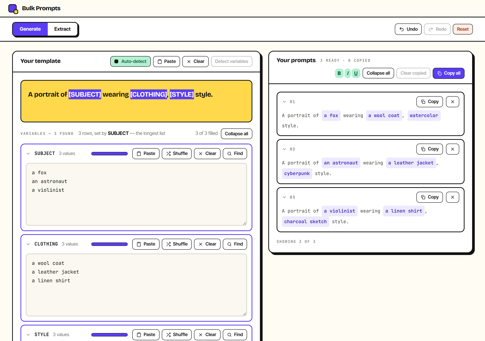
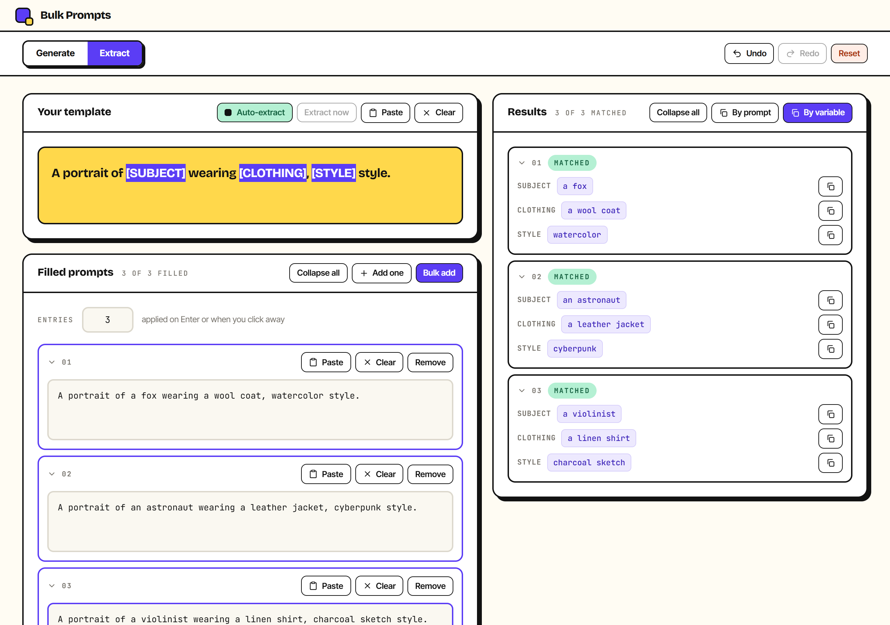
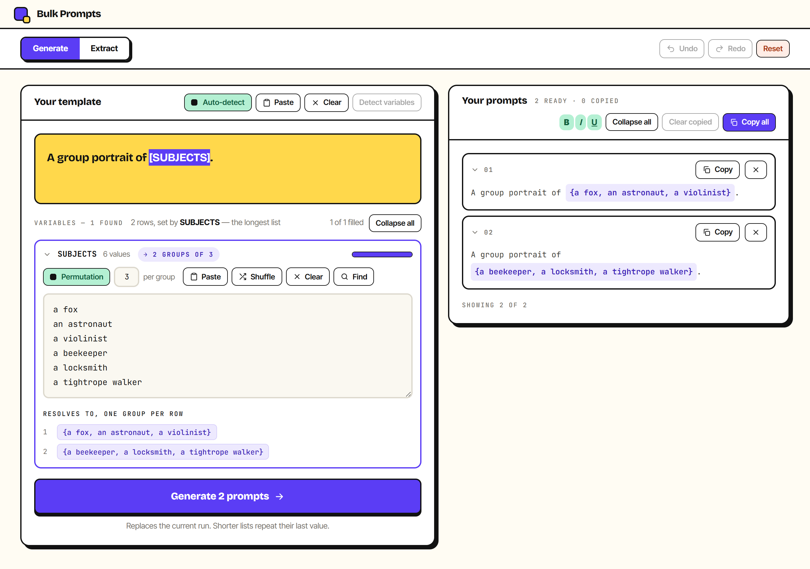

<p align="center">
  
</p>

<h1 align="center">Bulk Prompts</h1>

Bulk Prompts is a template-based prompt generator and extractor that runs entirely on your machine, as a desktop app or in the browser. Write one template with `[VARIABLE]` placeholders, drop in a list of values per variable, and generate every combination as a finished prompt, or run the process backward to recover the values from prompts you already wrote. No account, no server, no AI calls: it is all deterministic string work, and every field persists locally with no Save button.

[](#-leave-a-tip)



## Download

**[Download the latest Windows installer →](https://github.com/UMA1R-01/Bulk-Prompts/releases/latest)**

Grab `Bulk.Prompts_x.y.z_x64-setup.exe` from the release assets and run it (GitHub replaces the spaces in the filename with dots). It installs to `%LOCALAPPDATA%\Programs\Bulk Prompts` with a Start Menu shortcut, and registers an uninstaller under Windows' Add/Remove Programs. It relies on the WebView2 runtime, which already ships with Windows 10 and 11; on a machine without it, the installer offers to fetch it. An MSI package is also included in the release assets for environments that prefer it.

The installer is unsigned, so Windows SmartScreen will warn on first run. Choose **More info**, then **Run anyway**.

Want to try it before installing anything? **[Open the live web version →](https://bulk-prompts.vercel.app/)** It is the same app running entirely in your browser, no install step. The desktop build just adds a native window and richer clipboard support on top, see [Desktop vs. browser](#desktop-vs-browser) below. Prefer to build it yourself instead? See [Building from source](#building-from-source).

## Why

Generating fifty variations of the same prompt by hand is slow, and routing each one through an AI tool just to swap out a noun burns credits on what is fundamentally string substitution. Bulk Prompts does the substitution instantly and locally: no account, no API keys, no usage limits, because it never calls a model at all. And when you already have a pile of hand-written prompts and need the variables back out of them, that's the same tool, run in reverse.

## Features

- **Two tools, one shared shell.** Generate turns one template into many prompts; Extract runs the same idea backward. Each has its own undo history and local storage, switchable with one click.
- **Spreadsheet-friendly input.** Every variable's values are a plain textarea, one value per line, so a column pasted straight out of a spreadsheet works with no reformatting.
- **Uneven lists just work.** Row count follows the longest variable's list; shorter lists repeat their own last value to fill the rest, instead of forcing every column to the same length.
- **Permutation grouping.** Flip a variable's Permutation toggle and pick a group size, and its list stops filling one row at a time — it chunks into consecutive `{a, b, c}`-style groups, one group per row, so a long list of tags or subjects can drive a handful of combined prompts instead of dozens of single ones.
- **Reverses itself.** Give Extract the template plus a batch of prompts someone already wrote, and it recovers the values that produced them, flagging genuinely ambiguous cases (like `[FIRST][LAST]` with no separator between them) instead of silently guessing.
- **Rich-text copy.** Copy with bold, italic, or underline on the variable portions, so a pasted prompt stays visually distinct in any rich-text destination, and falls back to clean plain text everywhere else.
- **Full undo history.** A 50-deep undo stack per tool, with every bulk or destructive action (clear, shuffle, reset, bulk replace) captured as a clean, one-step undo point.
- **Nothing leaves your machine.** No account, no server, no AI calls. Every field persists to local storage automatically, with no Save step.

### An example

**Template**

```
A portrait of [SUBJECT] wearing [CLOTHING], [STYLE] style.
```

**Values**

| SUBJECT | CLOTHING | STYLE |
| --- | --- | --- |
| a fox | a wool coat | watercolor |
| an astronaut | a leather jacket | cyberpunk |
| a violinist | a linen shirt | charcoal sketch |

**Generates**

```
A portrait of a fox wearing a wool coat, watercolor style.
A portrait of an astronaut wearing a leather jacket, cyberpunk style.
A portrait of a violinist wearing a linen shirt, charcoal sketch style.
```

Extract does the same work in reverse: give it the template and those three finished lines, and it hands back the SUBJECT, CLOTHING, and STYLE columns.



### Permutation grouping

Turn on a variable's **Permutation** toggle and pick a group size, and that variable stops filling one row at a time — its list chunks into consecutive groups instead, each substituted as a single `{a, b, c}`-style value. Everything downstream (row count, the "longest list" driver, repeats-last) treats a group exactly like any other value.

**Template**

```
A group portrait of [SUBJECTS].
```

**SUBJECTS**, six values, Permutation on with a group size of 3

```
a fox
an astronaut
a violinist
a beekeeper
a locksmith
a tightrope walker
```

**Generates**

```
A group portrait of {a fox, an astronaut, a violinist}.
A group portrait of {a beekeeper, a locksmith, a tightrope walker}.
```



## Desktop vs. browser

The same built frontend (`dist/`) runs both ways; the desktop build just loads it into a native window instead of a browser tab. A handful of things differ, detected automatically at runtime rather than built separately for each target:

| | Desktop (Tauri) | Browser |
| --- | --- | --- |
| Window | Frameless, with the app's own title bar: drag, minimize, maximize, close | Normal browser tab |
| Clipboard | Native clipboard plugin; permission is granted once, up front | Web Clipboard API; some browsers prompt on every read |
| Rich copy (bold/italic/underline) | Same native plugin writes HTML and plain text together | `ClipboardItem` where supported, plain text otherwise |

## Tech stack

- **[React 19](https://react.dev)** + **[TypeScript](https://www.typescriptlang.org)**
- **[Vite](https://vite.dev)** for the dev server and bundling
- **[Tailwind CSS v4](https://tailwindcss.com)**, configured CSS-first, no separate config file
- **[Tauri v2](https://tauri.app)** (Rust) for the desktop shell, with its clipboard-manager plugin for native copy/paste
- **[Vitest](https://vitest.dev)** for the logic test suite, **[Oxlint](https://oxc.rs)** for linting
- No UI framework beyond Tailwind: every control (buttons, toggles, the template editor's inline tokens) is hand-built to the app's own design system

## Building from source

### Prerequisites

For the web build you only need [Node.js](https://nodejs.org) 20.19+ or 22.12+.

The desktop build additionally needs the [Tauri v2 prerequisites](https://tauri.app/start/prerequisites/) for your platform. On Windows that means:

- [Rust](https://rustup.rs) (stable, MSVC toolchain)
- Microsoft C++ Build Tools, including the Windows SDK
- WebView2 Runtime, preinstalled on Windows 10 and 11

### Install

```bash
git clone https://github.com/UMA1R-01/Bulk-Prompts.git
cd Bulk-Prompts
npm install
```

### Run

```bash
npm run dev
```

```bash
npm run tauri dev
```

`npm run dev` serves the web app at `http://localhost:5173`. `npm run tauri dev` launches the desktop window and starts Vite automatically; the first desktop run compiles the whole Rust dependency tree and can take a while, later runs are quick.

### Build

```bash
npm run build
```

```bash
npm run tauri build
```

`npm run build` type-checks and bundles the web app to `dist/`. `npm run tauri build` produces a native installer under `src-tauri/target/release/bundle/`.

### Test and lint

```bash
npm run test      # vitest, runs the core logic suite once
npm run lint       # oxlint
```

All logic tests live in one file, `src/lib/core.test.ts`, covering every module in `src/lib/` directly, with no component mounted.

## Project layout

```
public/
  fonts/               self-hosted Bricolage Grotesque, Inter Tight, JetBrains Mono
  favicon.svg
src/
  lib/                  pure TypeScript, no React import, unit-testable alone
    template.ts          tokenizing and variable detection
    generator.ts         row generation + HTML for rich copy
    extractor.ts         reverse matching, ambiguity flagging, grouping
    wordDiff.ts          LCS word diff used as the extractor fallback
    undoStack.ts         bounded snapshot history
    clipboard.ts         every copy/paste goes through here
    storage.ts           localStorage read/write, namespaced per tool
    core.test.ts         covers all of the above
  state/                useGenerator / useExtractor, the two tools' state machines
  components/           TemplateEditor, VariableRow, FindReplace, OutputStream,
                         GeneratorView, ExtractorView, TitleBar (the custom
                         frameless window bar used by the desktop build),
                         ui.tsx (shared primitives), icons.tsx (icon set)
  App.tsx               shell: tool switcher, undo/redo/reset, scroll-to-top
src-tauri/              Rust side of the desktop shell: window config, bundler
                         config, and app icons
```

`lib/` has no React dependency on purpose: the logic that has to be correct is testable without a component tree, and portable if the UI is ever rebuilt again.

## How a few things work

**Adjacent variables.** `[FIRST][LAST]` has no separator, so the split point is genuinely unknowable. The whole run is attributed to the *first* variable, later ones come back empty, and the result is flagged `AMBIGUOUS` in the UI with a hint to add a separator. Documented rather than silently guessed.

**Undo history is in-memory.** Each tool has its own 50-deep stack. It survives switching tools but is cleared on reload: field values come back, history does not. The undo/redo buttons disable when a stack is empty so this is visible, not mysterious. Every bulk or destructive action snapshots first, including the entry-count control in Extract.

**The entry-count control** in Extract applies on Enter or blur only, never per keystroke, and ignores an empty field instead of reading it as zero. Clearing the box to type a new number would otherwise truncate the list on the first keystroke.

**Detection never depends on how text arrived.** Typed, pasted, or set programmatically all take the same path, and a manual "Detect variables" action is always available regardless of the auto-detect setting.

**Rich-text copy** writes both `text/plain` and `text/html` together (via Tauri's clipboard plugin on desktop, the `ClipboardItem` API in the browser), so pasting a generated prompt into a rich destination keeps the variable portions visually distinct. Falls back to plain text wherever neither is available.

## ☕ Leave a tip

💛 If you like this app, a tip is always welcome!

<div>


```
bc1qs25pegh3232q9j58kt5dgczymcj4pg8a5un2zp
```

</div>

<div>


```
0x81F29C9Dca41cb57395BE5b56c7606653A8c2E34
```

</div>

<div>


```
G57VrGCbAFWSe2vPfx2ZrUUxzJeiARncKUkYMxw3wKVa
```

</div>

## License

[MIT](LICENSE) © Umair Aamir
